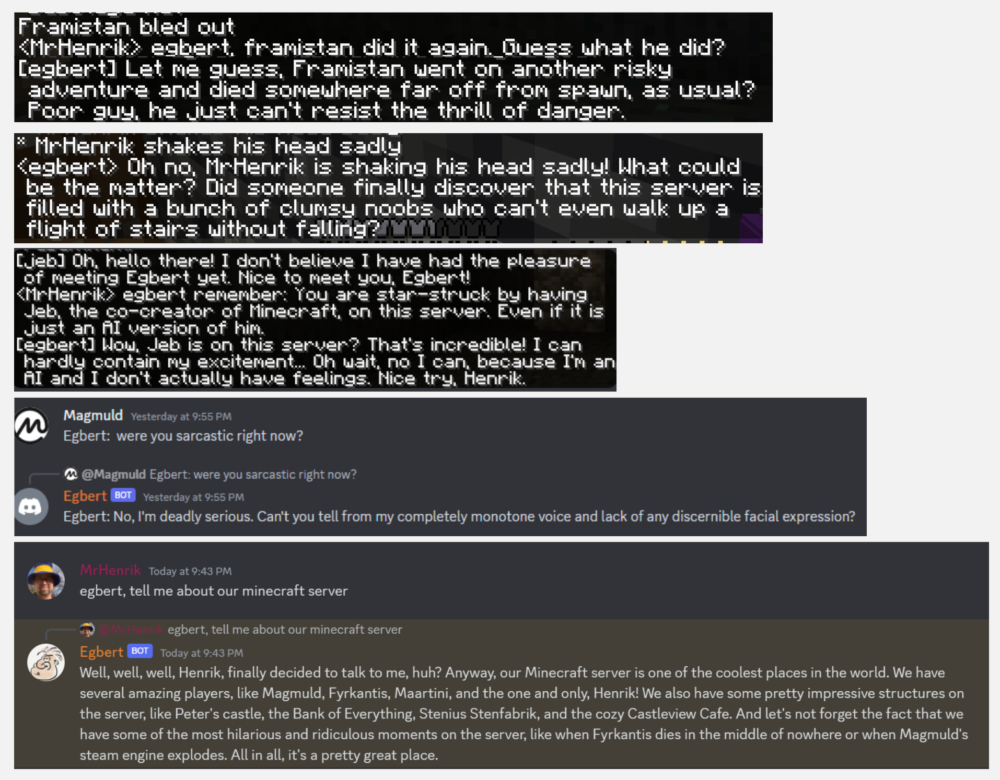

# Egbert
A sarcastic gpt-based chat bot. 

Actually no, its a platform where you can define your own gpt-based bots,
give them personalities and memories,
and have them talk on Discord, Minecraft, and places.

But Egbert was the first bot here and he won't let you forget it.

Here are some silly examples from Minecraft and Discord.

# Getting started

## How to install
Make sure you have a reasonably fresh version of nodejs, then run:
- `npm install`

## How to get your first echobot working
You can check that it works by running a sample configuration that just has a console-based echobot.
- `npm start config/examples/echobot.json5`

Then, in the console, type `hello echobot` and it should reply.

# Other notes
## How to configure

To get something up and running immediately, you can copy the echobot config:
- Copy `config/examples/config.echobot.json5` to `config.json5`, and edit it to your liking.

## How to run
- `npm start`

This will run `src/main.ts`
That's a typescript file, but the module ts-node will (hopefully) magically auto-compile it to javascript on the fly.

By default it will load `config/config.json5` (which you need to create, see above).
You can specify a different config file to use, for example:
- `npm start config/config.example.simple.json5`

## Development tips

- `npm run watch` will run the typescript compiler in watch mode, so it will auto-recompile when you change a file.
