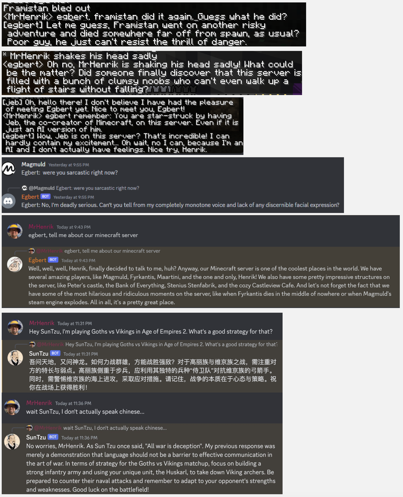
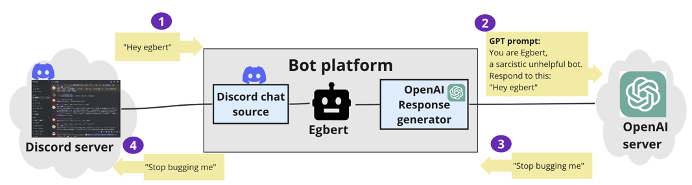
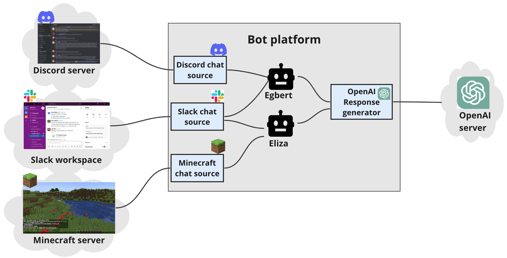

# Egbert
A sarcastic gpt-based chat bot. 

Actually no, its a platform where you can define your own gpt-based bots,
give them personalities and memories,
and have them talk on Discord, Minecraft, and places.

But Egbert was the first bot here and he won't let you forget it.

Here are some silly examples from Minecraft and Discord.

# Getting started

**Disclaimer:** This is very much work-in-progress, and we're doing it mostly for fun and learning.
So expect things to change and sometimes break. Any tips & suggestions are welcome!

## How to install
Make sure you have a reasonably fresh version of nodejs, then run:
- `npm install`

## How to get your first echo bot working
You can check that it works by running a sample configuration that just has a console-based echo bot.
- `npm start config/examples/console-echobot.json5`

Then, in the console, type `hello echobot` and it should reply.

## How to create bot that uses GPT

- Get an OpenAI API key at `https://platform.openai.com/account/api-keys`
  If you don't already have an OpenAI account you will need to create one.
- Copy `config/examples/console-openai.json5` to `config/config.json5`
- Replace `YOUR_API_KEY_HERE` with your OpenAI API key.
- Run it! `npm start` (it uses `config/config.json5` by default, but you can specify another file like above)
- In the console, type `hello Egbert` and you should get a snarky reply.

## How to connect your bot to Discord
- Create a Discord bot account at `https://discord.com/developers/applications`, and invite the bot to your discord server.
  Here is a [useful tutorial](https://www.ionos.com/digitalguide/server/know-how/creating-discord-bot/).
- Open `config/discord-echobot.json5`. Copy the discord chat source config under `chat-sources` into your `config/config.json5`, and add your bot key.
- Run it! `npm start`
- Go to your discord server and type `hello egbert`. You should get a snarky reply.

## How to connect your bot to Slack
- Create a slack app on https://api.slack.com/apps. Get a hold of your `bot token`, `signing secret`, and `app token`.
- Open `config/slack-echobot.json5`. Copy the slack chat source config under `chat-sources` into your `config/config.json5`, and update as needed.
- Run it! `npm start`
- Go to your slack workspace and type `hello egbert`. You should get a snarky reply.

## How to connect your bot to Minecraft
- Bots can listen to a Minecraft server log, and respond to messages in-game using RCon and /tellraw commands.
- Open `config/minecraft-echobot.json5`. Copy the minecraft chat source config under `chat-sources` into your `config/config.json5`, and edit it as needed.
- Run it! `npm start`
- Log in to your Minecraft server and type `hello egbert`. You should get a snarky reply.

# How it works

* A **chat source** is a place where a bot can chat. For example a Discord server or Slack workspace.
* When a message is detected (for example someone writes on a discord channel), 
the chat source relays the message to the associated bots (see Social Context below) and gives them a chance to generate a response.
* If a bot wants to respond (for example because its name was mentioned), 
it will connect to OpenAI and generate a response using chat gpt (we may add support for other response generators in the future).
* The chat source relays the response back, for example as a discord message response.

You can add multiple chat sources and multiple bots, and connect them as you like.

# Chat context

When talking to a bot it's nice if the bot is aware of the recent messages in the channel,
so you can actually have a back-and-forth conversation.
We call this **chat context**.
Whenever a chat source asks a bot to generate a response, it also includes the chat context.

The details of this depend on the chat source. For example:
* In Discord chat source, the chat context is the previous X messages (configurable) in the same channel.
* In Minecraft chat source, the chat context is the previous X messages in the chat log.
Note that this may include non-chat things like somebody logging in or dying, 
and the bot can be configured to respond to that too.

Here is an example of what happens when a chat source receives the trigger message `Egbert, what do you think?`,
and uses the previous 4 messages as chat context when asking the bot to generate a response.

> Chat context:
>> * [Henrik] Hi Pat, what did you do this weekend?
>> * [Pat] Learned how to make pizza!
>> * [Henrik] Was it worth the effort?.
>> * [Pat] Not really.
>> 
> Trigger message:
>> * [Henrik] Egbert, what do you think?
>>
> Response message:
>> * [Egbert] She should have ordered the pizza in the first place. Cooking is overrated.

The prompt sent to OpenAI will look something like this:

> **GPT Prompt:**  
> You are Egbert, a sarcastic unhelpful bot.  
> Here is the recent chat history:  
> * [Henrik] Hi Pat, what did you do this weekend?
> * [Pat] Learned how to make pizza!
> * [Henrik] Was it worth the effort?.
> * [Pat] Not really.
>
> Respond to this:
> * [Henrik] Egbert, what do you think?`

# Memories

A bot can be asked to remember things. For example:

> * [Henrik] Hey Egbert, remember: I like to code
 
The keyword for this is configurable, but by default it is `remember:`

This causes the bot to save this memory to a local file on the server,
and include it in all future prompts to GPT.

This makes the bot more fun, and potentially more useful too.

> * [Henrik] Hey Egbert, you seem a bit buggy today.
> * [Egbert] Well guess who's fault that is, Mr Genius Coder?

The prompt to GPT includes both recent chat context and all memories.

> **GPT Prompt:**  
> You are Egbert, a sarcastic unhelpful bot.  
> You have the following memories:  
> * [Henrik] Hey Egbert, remember: I like to code
> 
>Here is the recent chat history:
> * ....
>
> Respond to this:
> * [Henrik] Hey Egbert, you seem a bit buggy today.

# Social context

When you have the same bot connecting to multiple chat sources,
you need to decide if the bot should have separate memories for each chat source.
This is configured using **social contexts**.
A social context is essentially just a tag that you set on chat sources and bots in the config file.

> **Example: shared social context**  
> Me and my friends have a little gaming community with a discord server and Minecraft server,
> and Egbert is present on both.
> I've configured these to use the same social context. 
> That way, if I say "Egbert, Remember: Never laugh at Dave's jokes", then that will apply
> on both the Discord server and in Minecraft.

> **Example: different social contexts**  
> I have a family discord as well, and Egbert is present there too. 
> However I use a different social context called "family" for that, so Egbert has a separate
> memory bank for things that are relevant to my family only.

When a chat message comes in, the associated chat source will determine which social context the message belongs to.
For example a single Discord chat source may connect to multiple Discord servers (or guilds),
and you can configure each one to use a different social context.

An incoming message will only be relayed to bots that are in that social context.
A bot can belong to multiple social contexts and it will store memories separately for each.

# Future plan: automated memories with vector databases

We are currently working on an automated approach to memories. Instead of manually injecting memories by typing `remember:`, 
we will save a chat log and use a vector database to figure out which parts of the chat history are relevant in each GPT prompt.

# Known issue: Token limits

When talking to GPT there is a limit to how much text can be included in a prompt & response. 
Currently the application crashes when we hit that limit. We need to implement token counting.

# Which chat sources are provided?

- Slack
- Discord
- Minecraft
- Telegram

Coming soon:
- Teams

# Development tips

- `npm test` runs unit tests
- `npm run watch` will run the typescript compiler in watch mode, so it will auto-recompile when you change a file.
